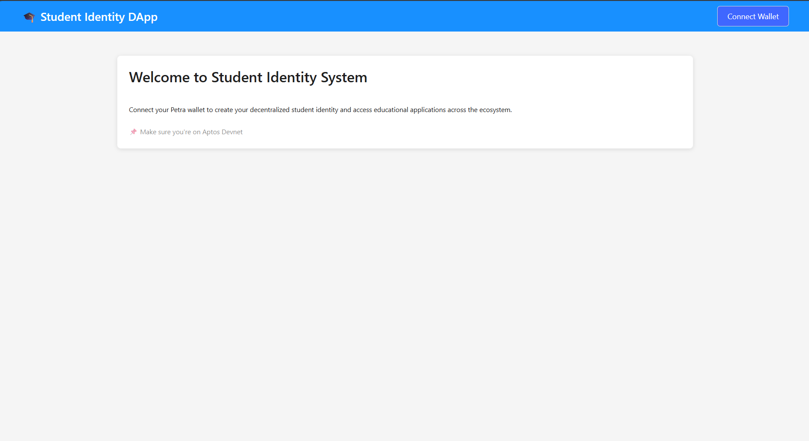
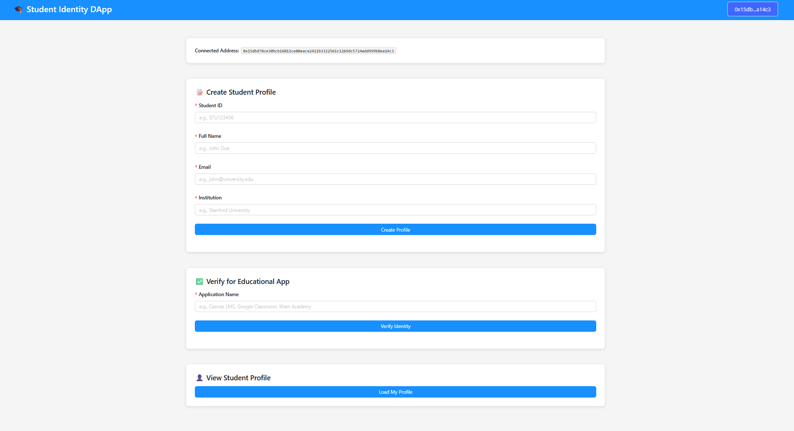
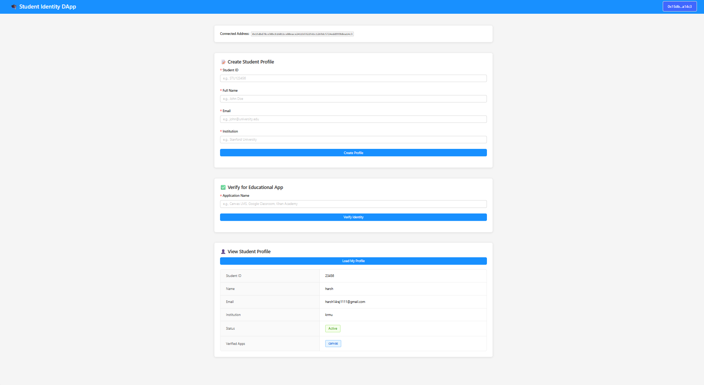
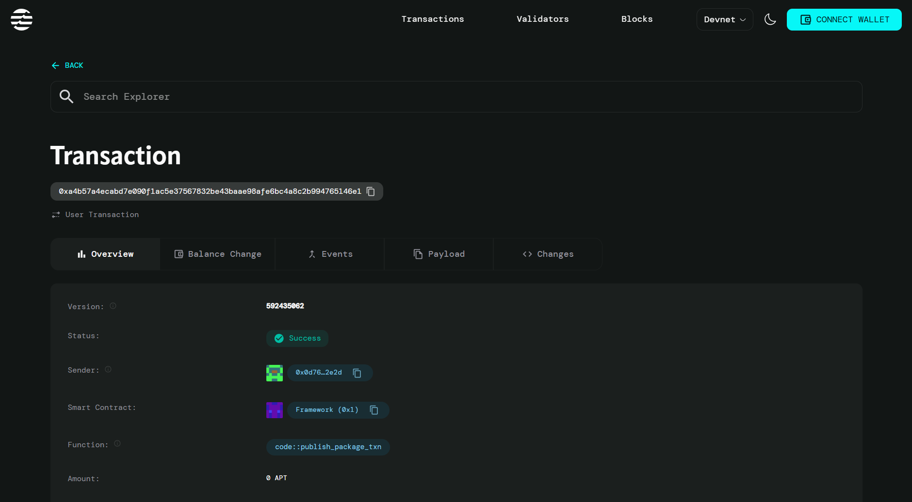

# Decentralized Identity for Students – Login across apps(FullStack)


A blockchain-based decentralized identity system built on the Aptos blockchain that allows students to create a single identity profile and use it to login across multiple educational applications seamlessly.

Cheak The Live App - [Vercel App Student Identity DApp ](https://decentralized-identity-for-students.vercel.app/)

 
 



## 📋 Description

This DApp (Decentralized Application) provides students with a self-sovereign identity solution where they control their own credentials. Instead of creating separate accounts for each educational platform, students can create one profile on the blockchain and verify themselves for any application in the educational ecosystem.

### Key Features

- **🔐 Single Sign-On**: One identity across multiple educational apps
- **⛓️ Blockchain-Based**: Secure, immutable identity storage on Aptos
- **👤 Self-Sovereign**: Students control their own data
- **✅ App Verification**: Easily verify identity for new educational platforms
- **🔒 Privacy-Focused**: Only you control your identity information

### Use Cases

- Access Learning Management Systems (Canvas, Blackboard, Moodle)
- Login to online course platforms (Coursera, Udemy, Khan Academy)
- Verify student status for educational discounts
- Single identity across university services
- Portable credentials that follow you throughout your education journey

## 🛠️ Technology Stack

- **Frontend**: React + Vite
- **Styling**: Ant Design (antd)
- **Blockchain**: Aptos Network (Devnet)
- **Smart Contract**: Move Language
- **Wallet**: Petra Wallet Integration
- **SDK**: Aptos TypeScript SDK

## 📁 Project Structure

```
Decentralized-Identity-for-Students/
├── sources/
│   └── Decentralized_Identity_for_Students.move
├── Move.toml
├── frontend/
│   ├── src/
│   │   ├── components/
│   │   │   ├── CreateProfile.jsx
│   │   │   ├── VerifyApp.jsx
│   │   │   └── ViewProfile.jsx
│   │   ├── App.jsx
│   │   ├── App.css
│   │   ├── main.jsx
│   │   └── index.css
│   ├── package.json
│   └── vite.config.js
└── README.md
```

## 🚀 Prerequisites

Before you begin, ensure you have the following installed:

- **Node.js** (v16 or higher) - [Download](https://nodejs.org/)
- **npm** or **yarn**
- **Aptos CLI** - [Installation Guide](https://aptos.dev/cli-tools/aptos-cli-tool/install-aptos-cli)
- **Petra Wallet** (Browser Extension) - [Download](https://petra.app/)

## 📦 Installation & Setup

### Step 1: Clone the Repository

```bash
git clone <your-repo-url>
cd Decentralized-Identity-for-Students
```

### Step 2: Deploy Smart Contract

1. **Initialize Aptos Account** (if you haven't already):
```bash
aptos init
```
Select `devnet` when prompted for network.

2. **Compile the Move Module**:
```bash
aptos move compile
```

3. **Deploy to Devnet**:
```bash
aptos move publish
```

4. **Copy the Module Address**: After deployment, copy your module address. It will look like:
```
0x0d76dc3715a126a103d3bd6367362196c4d07e89465c82305c024b4afc4f2e2d
```

5. **Update Frontend Configuration**: Open these files and replace `MODULE_ADDRESS` with your deployed address:
   - `frontend/src/components/CreateProfile.jsx`
   - `frontend/src/components/VerifyApp.jsx`
   - `frontend/src/components/ViewProfile.jsx`

### Step 3: Install Frontend Dependencies

```bash
cd frontend
npm install
```

### Step 4: Run the Development Server

```bash
npm run dev
```

The application will be available at `http://localhost:5173`

## 🎮 How to Use

### 1. Connect Wallet
- Click on "Connect Wallet" button in the top-right corner
- Select Petra Wallet
- Approve the connection
- Make sure you're on **Aptos Devnet**

### 2. Get Test APT (if needed)
- Visit [Aptos Faucet](https://aptoslabs.com/testnet-faucet)
- Enter your wallet address
- Request test tokens for gas fees

### 3. Create Your Student Profile
- Fill in your details:
  - Student ID
  - Full Name
  - Email
  - Institution Name
- Click "Create Profile"
- Approve the transaction in Petra Wallet

### 4. Verify for Educational Apps
- Enter the name of the educational app you want to access
- Click "Verify Identity"
- Approve the transaction

### 5. View Your Profile
- Click "Load My Profile"
- View your student information and all verified apps

## 🌐 Deploying to Vercel

### Method 1: Using Vercel CLI

1. **Install Vercel CLI**:
```bash
npm install -g vercel
```

2. **Navigate to Frontend Directory**:
```bash
cd frontend
```

3. **Deploy**:
```bash
vercel
```

Follow the prompts:
- Set up and deploy? `Yes`
- Which scope? Select your account
- Link to existing project? `No`
- Project name? `student-identity-dapp` (or your preferred name)
- In which directory is your code located? `./`
- Want to override settings? `No`

4. **Deploy to Production**:
```bash
vercel --prod
```

### Method 2: Using Vercel Dashboard

1. **Prepare for Deployment**:
   - Make sure all your changes are committed to Git
   - Push to GitHub/GitLab/Bitbucket

2. **Create `vercel.json`** in your `frontend` directory:
```json
{
  "buildCommand": "npm run build",
  "outputDirectory": "dist",
  "devCommand": "npm run dev",
  "installCommand": "npm install"
}
```

3. **Deploy on Vercel**:
   - Go to [vercel.com](https://vercel.com)
   - Click "Add New Project"
   - Import your Git repository
   - Configure project:
     - **Framework Preset**: Vite
     - **Root Directory**: `frontend`
     - **Build Command**: `npm run build`
     - **Output Directory**: `dist`
   - Click "Deploy"

4. **Your app will be live at**: `https://your-project-name.vercel.app`

### Environment Variables (if needed)

If you want to make the module address configurable:

1. Create `.env` file in `frontend`:
```env
VITE_MODULE_ADDRESS=0x0d76dc3715a126a103d3bd6367362196c4d07e89465c82305c024b4afc4f2e2d
```

2. Update your components to use:
```javascript
const MODULE_ADDRESS = import.meta.env.VITE_MODULE_ADDRESS;
```

3. Add environment variable in Vercel:
   - Go to Project Settings → Environment Variables
   - Add `VITE_MODULE_ADDRESS` with your module address

## 🔧 Configuration

### Update Module Address

If you redeploy the smart contract, update the `MODULE_ADDRESS` in:
- `CreateProfile.jsx` (Line 9)
- `VerifyApp.jsx` (Line 9)
- `ViewProfile.jsx` (Line 9)

### Change Network

To switch from Devnet to Mainnet:
1. Update `main.jsx`:
```javascript
dappConfig={{ network: Network.MAINNET }}
```
2. Update all component files:
```javascript
const config = new AptosConfig({ network: Network.MAINNET });
```

## 🐛 Troubleshooting

### White Screen After Connecting Wallet
- Make sure you're using the fixed `App.jsx` with `account?.address?.toString()`

### "Profile Not Found" Error
- Create a profile first using the "Create Student Profile" form
- Make sure you're connected with the same wallet used to create the profile

### Transaction Fails
- Ensure you have enough APT in your wallet for gas fees
- Verify you're on the correct network (Devnet)
- Check that the MODULE_ADDRESS matches your deployed contract

### Profile Won't Load
- Verify the MODULE_ADDRESS is correct
- Check browser console for error messages
- Ensure the profile was created successfully

## 📝 Smart Contract Functions

### Entry Functions
- `create_student_profile`: Creates a new student identity profile
- `verify_for_app`: Adds an app to the verified apps list

### View Functions
- `get_student_id`: Retrieves student ID for an address
- `profile_exists`: Checks if a profile exists for an address

## 🤝 Contributing

Contributions are welcome! Please feel free to submit a Pull Request.


## 👥 Support

For questions or issues:
- Open an issue on GitHub
- Check [Aptos Documentation](https://aptos.dev/)
- Visit [Aptos Discord](https://discord.gg/aptoslabs)

## 🎯 Future Enhancements

- [ ] Add profile editing functionality
- [ ] Implement profile deactivation
- [ ] Add credential verification for institutions
- [ ] Integration with OAuth providers
- [ ] Mobile app version
- [ ] Multi-signature support for institutional verification
- [ ] IPFS integration for storing additional documents

---

Built with ❤️ on the Aptos Blockchain

## Contract Details
0x8ae2a5afadc62a517674b3551aa18b96062a51a95d58a14a1f98fe9414a987aa
6c539eec1285cd37bb4cda5abebd21500cb0eb74

