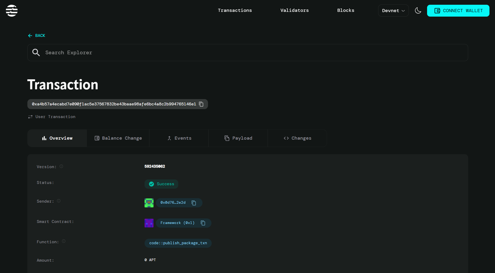

# Decentralized Identity for Students – Login across apps

## Project Description

The Decentralized Identity for Students project is a blockchain-based smart contract solution built on the Aptos network that enables students to create and manage a unified digital identity. This identity can be used to authenticate and access multiple educational applications and platforms without the need for separate registration processes on each platform.

The smart contract provides a secure, decentralized way for students to store their academic credentials and identity information on-chain, while maintaining privacy and control over their personal data. Educational apps and platforms can verify student authenticity through this decentralized system, creating a seamless login experience across the entire educational ecosystem.

## Project Vision

Our vision is to revolutionize the way students interact with educational technology by creating a unified, secure, and student-controlled identity management system. We aim to eliminate the friction of multiple registrations, reduce identity fraud in educational settings, and empower students with complete ownership of their academic identity data.

By leveraging blockchain technology, we envision a future where students can seamlessly access any educational platform, carry their verified credentials across institutions, and maintain a permanent, tamper-proof record of their academic journey that follows them throughout their educational career.

## Key Features

### 🔐 **Decentralized Identity Creation**
- Students can create a unique on-chain identity profile with essential information
- Secure storage of student ID, name, email, and institutional affiliation
- Self-sovereign identity model where students own and control their data

### 🎓 **Cross-Platform Verification**
- Single identity can be verified across multiple educational applications
- Streamlined app onboarding without repetitive registration processes
- Maintains a record of all verified applications for transparency

### 🛡️ **Security & Privacy**
- Blockchain-based immutable identity records
- Cryptographic verification prevents identity tampering
- Students maintain full control over their identity data

### ✅ **Institution Integration**
- Links student identity to their educational institution
- Enables institution-level verification and authentication
- Supports academic credential validation

### 📱 **Multi-App Ecosystem**
- Designed for integration with various educational platforms
- Scalable verification system for unlimited applications
- Reduces development overhead for educational app creators

## Future Scope

### 🎯 **Enhanced Credential Management**
- Integration with academic transcript systems
- Support for digital diplomas and certificates
- Verification of completed courses and achievements
- Grade point average (GPA) and academic standing tracking

### 🌐 **Cross-Institution Portability**
- Transfer credits and credentials between institutions
- Support for international student mobility
- Recognition of online courses and MOOCs
- Academic portfolio management across multiple institutions

### 🤝 **Industry Integration**
- Connection with employer verification systems
- Integration with professional networking platforms
- Support for internship and job application processes
- Skills and competency verification for career development

### 🔒 **Advanced Privacy Features**
- Zero-knowledge proof implementations for selective disclosure
- Granular permission controls for data sharing
- Anonymous verification options for sensitive applications
- GDPR and privacy regulation compliance tools

### 📊 **Analytics & Insights**
- Academic performance analytics across platforms
- Learning pathway recommendations
- Career guidance based on academic history
- Institutional reporting and student success metrics

### 🚀 **Technical Enhancements**
- Mobile wallet integration for easier access
- Biometric authentication options
- Multi-signature support for institutional endorsements
- Integration with existing identity providers (OAuth, SAML)
- Support for NFT-based achievement badges and certificates

## Contract Details
0x8ae2a5afadc62a517674b3551aa18b96062a51a95d58a14a1f98fe9414a987aa
